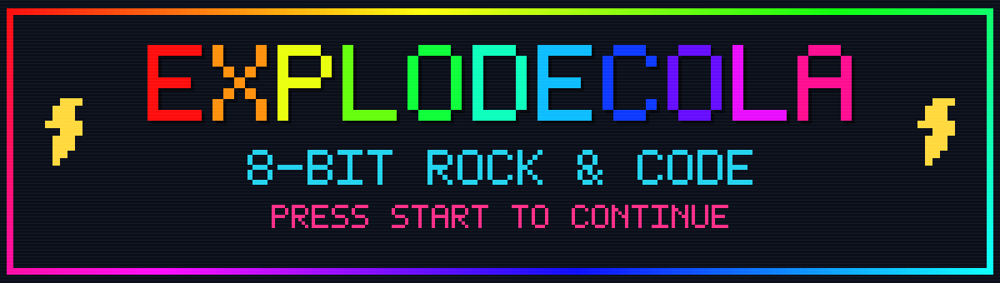
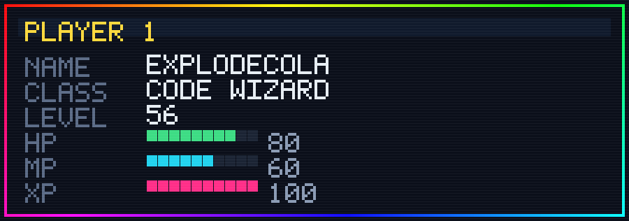
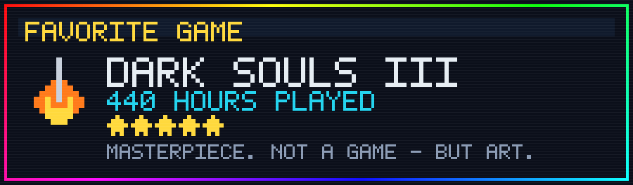
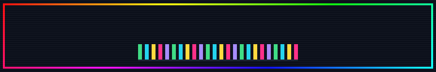

  

### `▸ PLAYER STATUS`

### `▸ FAVORITE GAME`

  <i>神作，它不是游戏，而是艺术品.</i>

### `▸ NOW PLAYING`

  
  
  

### `▸ HIGH SCORES`

  

  

### `▸ POWER-UPS`

<!-- ▼▼ 删掉你不用的，或加你自己的 ▼▼ -->

  
  
  
  
  
  
  
  

### `▸ CONTINUE?`

  
  
  
    
  

 

  <code>INSERT COIN TO CONTINUE &nbsp;·&nbsp; 10 种彩虹像素边框见 assets/pixel/</code>

