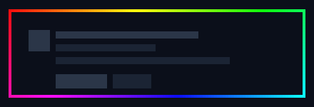
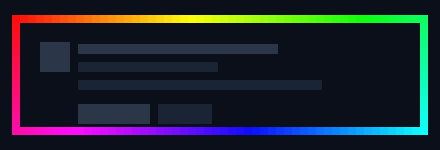
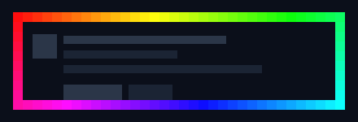
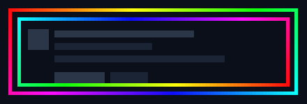
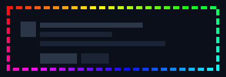
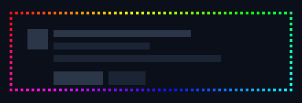
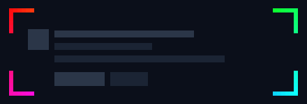
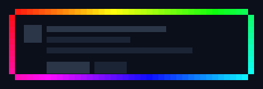
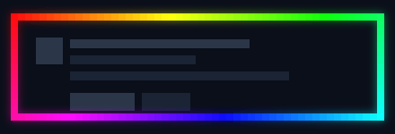
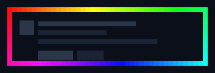

<div align="center">

# Pixel Rainbow Borders

**彩虹 · 像素风边框组件 &nbsp;·&nbsp; 10 种 &nbsp;·&nbsp; 纯 SVG**

不是渐变描边 —— 边框由一个个方块拼成，每个方块按周长单独取一个彩虹色相。

</div>

<br>

<table>
<tr>
<td width="50%" align="center">
<picture>
<source media="(prefers-color-scheme: light)" srcset="assets/pixel/pixel-4-light.svg">

</picture>
<br><sub><b>PIXEL-4</b> &nbsp;·&nbsp; 方块 4px · 细</sub>
</td>
<td width="50%" align="center">
<picture>
<source media="(prefers-color-scheme: light)" srcset="assets/pixel/pixel-8-light.svg">

</picture>
<br><sub><b>PIXEL-8</b> &nbsp;·&nbsp; 方块 8px · 中</sub>
</td>
</tr>
<tr>
<td width="50%" align="center">
<picture>
<source media="(prefers-color-scheme: light)" srcset="assets/pixel/pixel-12-light.svg">

</picture>
<br><sub><b>PIXEL-12</b> &nbsp;·&nbsp; 方块 12px · 粗</sub>
</td>
<td width="50%" align="center">
<picture>
<source media="(prefers-color-scheme: light)" srcset="assets/pixel/pixel-double-light.svg">

</picture>
<br><sub><b>PIXEL-DOUBLE</b> &nbsp;·&nbsp; 双环 · 相位差半圈</sub>
</td>
</tr>
<tr>
<td width="50%" align="center">
<picture>
<source media="(prefers-color-scheme: light)" srcset="assets/pixel/pixel-dash-light.svg">

</picture>
<br><sub><b>PIXEL-DASH</b> &nbsp;·&nbsp; 2 格亮 1 格灭</sub>
</td>
<td width="50%" align="center">
<picture>
<source media="(prefers-color-scheme: light)" srcset="assets/pixel/pixel-dot-light.svg">

</picture>
<br><sub><b>PIXEL-DOT</b> &nbsp;·&nbsp; 点阵 1/3 · 4px 点</sub>
</td>
</tr>
<tr>
<td width="50%" align="center">
<picture>
<source media="(prefers-color-scheme: light)" srcset="assets/pixel/pixel-corner-light.svg">

</picture>
<br><sub><b>PIXEL-CORNER</b> &nbsp;·&nbsp; 只留四角</sub>
</td>
<td width="50%" align="center">
<picture>
<source media="(prefers-color-scheme: light)" srcset="assets/pixel/pixel-notch-light.svg">

</picture>
<br><sub><b>PIXEL-NOTCH</b> &nbsp;·&nbsp; 四角切掉 1 格</sub>
</td>
</tr>
<tr>
<td width="50%" align="center">
<picture>
<source media="(prefers-color-scheme: light)" srcset="assets/pixel/pixel-glow-light.svg">

</picture>
<br><sub><b>PIXEL-GLOW</b> &nbsp;·&nbsp; 同色光晕 σ=5</sub>
</td>
<td width="50%" align="center">
<picture>
<source media="(prefers-color-scheme: light)" srcset="assets/pixel/pixel-anim-light.svg">

</picture>
<br><sub><b>PIXEL-ANIM</b> &nbsp;·&nbsp; 流动彩虹 · 4s 循环</sub>
</td>
</tr>
</table>

<br>

## 怎么做的

沿边框走一圈，把周长均分成 N 个方块，第 i 个方块取色相 `i / N × 360°`：

```python
for i, (px, py) in enumerate(perimeter_cells):      # 顺时针枚举边框格子
    t = i / len(perimeter_cells)
    rect(px, py, step, step, fill=hsv_to_rgb(t, 0.95, 1.0))
```

这样得到的是**逐格离散上色**，不是 `linearGradient`。区别在于：方块之间能看到明确的色阶边界，放大后每一格都还是纯色 —— 这才是像素画。渐变描边放大会露馅。

`PIXEL-ANIM` 给每个方块挂一个 `<animate>`，`begin` 按它在周长上的位置错开，颜色就沿着边框跑起来了（102 个方块，一个 SVG 文件搞定，不需要 GIF 或视频）。

## 两个让像素保持锐利的细节

**整数坐标 + `shape-rendering="crispEdges"`** —— 方块边长等于步进，位置都是步进的整数倍，相邻方块严丝合缝；`crispEdges` 关掉抗锯齿，否则方块交界处会糊出一条半透明缝，像素感立刻消失。

**方块边长 = 边框粗细** —— 边框正好一格厚，色相绕周长一圈连续，不会出现一层层重复的彩虹条纹。

## 参数

| 参数 | 位置 | 当前值 |
|---|---|---|
| 画布 | `W, H` | `440 × 150` |
| 边距 | `MARGIN` | `12` |
| 方块边长 / 边框粗细 | 各 builder 的 `step` | `4 / 8 / 10 / 12` |
| 饱和度 / 明度 | `hue(t, sat, val)` | `0.95 / 1.0` |
| 承载面 | `THEMES[*]["surface"]` | 暗 `#0b0f1a` / 亮 `#ffffff` |
| 骨架内容 | `content(t)` | 纯方角，无圆角 |
| 动画时长 | `b_anim` 的 `dur` | `4s` |

改成 `MARGIN` 或 `step` 会改变格子数量，色相也会跟着重新分配 —— 不用手动调色。

## 复用

每个组件都是独立 SVG，直接复制 `assets/pixel/` 里的文件，或者内联后把 `fill` 交给 CSS 接管。想改配色就动 `hue()` 的饱和度和明度，想让彩虹反向就换成 `hue(-t)`。

## 历史版本

| 提交 | 版本 |
|---|---|
| 当前 | 彩虹像素边框 |
| `07b9450` | 12 种平滑矢量边框 |
| `6bba778` | Steam 资料页复刻 |
| `d43fbd2` | 8-bit 像素摇滚 |

旧素材都还在 `assets/` 里，README 没引用所以主页上看不到。
