

  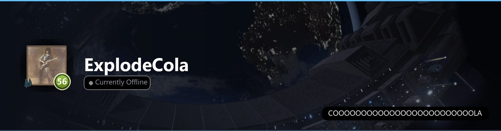

<!-- ============================ FAVORITE GAME ============================ -->
<picture>
  <source media="(prefers-color-scheme: light)" srcset="assets/steam/bar-favorite-light.png">
  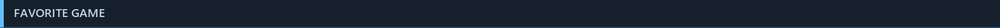
</picture>

<picture>
  <source media="(prefers-color-scheme: light)" srcset="assets/steam/panel-favorite-light.png">
  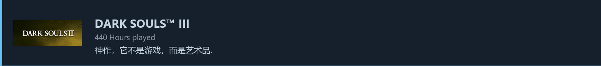
</picture>

<!-- ========================= ACHIEVEMENT SHOWCASE ======================== -->
<picture>
  <source media="(prefers-color-scheme: light)" srcset="assets/steam/bar-achievements-light.png">
  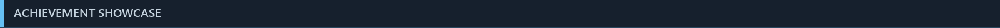
</picture>

  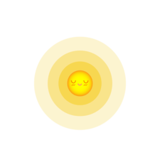
   
  This user's profile has been given the <b>Wholesome</b> award

<!-- ============================== GITHUB STATS =========================== -->
<picture>
  <source media="(prefers-color-scheme: light)" srcset="assets/steam/bar-stats-light.png">
  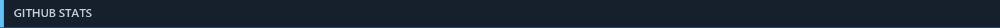
</picture>

  

  

<!-- ================================ BADGES =============================== -->
<picture>
  <source media="(prefers-color-scheme: light)" srcset="assets/steam/bar-badges-light.png">
  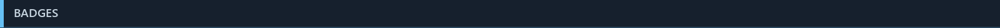
</picture>

<!-- ▼▼ 删掉你不用的，或加你自己的 ▼▼ -->

  
  
  
  
  
  
  
  

<!-- ================================ LINKS ================================ -->
<picture>
  <source media="(prefers-color-scheme: light)" srcset="assets/steam/bar-links-light.png">
  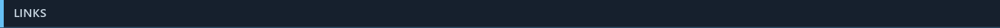
</picture>

<!-- ▼▼ 换成你自己的链接 ▼▼ -->

  <a href="https://github.com/ExplodeCola"><picture>
    <source media="(prefers-color-scheme: light)" srcset="assets/steam/btn-github-light.png">
    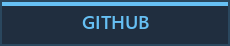
  </picture></a>
  <a href="https://steamcommunity.com/id/ExplodeCola"><picture>
    <source media="(prefers-color-scheme: light)" srcset="assets/steam/btn-steam-light.png">
    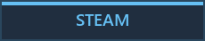
  </picture></a>
  <a href="mailto:you@example.com"><picture>
    <source media="(prefers-color-scheme: light)" srcset="assets/steam/btn-email-light.png">
    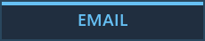
  </picture></a>

 

  

