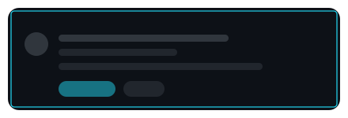
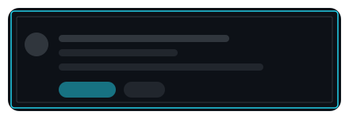
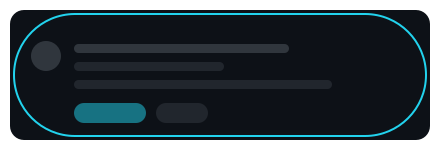
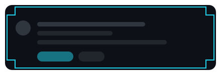
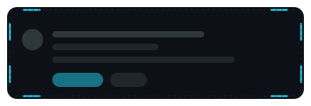
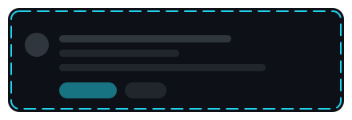
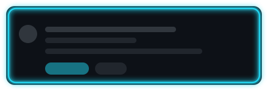
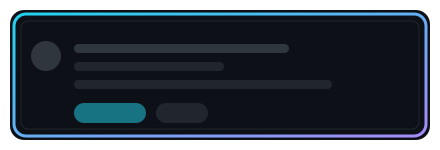
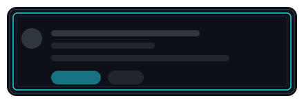
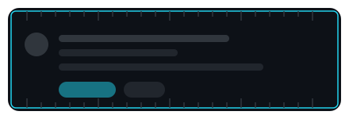

<div align="center">

# Border Components

**一套可复用的边框 UI 组件 · 12 种 · 纯 SVG · 明暗双版**

每个组件都是独立自包含的 SVG：自带承载面、边框与骨架内容，拖进任何项目就能用。

</div>

<br>

<table>
<tr>
<td width="50%" align="center">
<picture>
<source media="(prefers-color-scheme: light)" srcset="assets/borders/hairline-light.svg">

</picture>
<br><sub><b>HAIRLINE</b> &nbsp;·&nbsp; 1.25px 单线</sub>
</td>
<td width="50%" align="center">
<picture>
<source media="(prefers-color-scheme: light)" srcset="assets/borders/double-light.svg">

</picture>
<br><sub><b>DOUBLE</b> &nbsp;·&nbsp; 双层描边 1.5 / 1px</sub>
</td>
</tr>
<tr>
<td width="50%" align="center">
<picture>
<source media="(prefers-color-scheme: light)" srcset="assets/borders/rounded-light.svg">

</picture>
<br><sub><b>ROUNDED</b> &nbsp;·&nbsp; 圆角 20px</sub>
</td>
<td width="50%" align="center">
<picture>
<source media="(prefers-color-scheme: light)" srcset="assets/borders/capsule-light.svg">

</picture>
<br><sub><b>CAPSULE</b> &nbsp;·&nbsp; 全圆角 r = h/2</sub>
</td>
</tr>
<tr>
<td width="50%" align="center">
<picture>
<source media="(prefers-color-scheme: light)" srcset="assets/borders/chamfer-light.svg">

</picture>
<br><sub><b>CHAMFER</b> &nbsp;·&nbsp; 斜切角 20px</sub>
</td>
<td width="50%" align="center">
<picture>
<source media="(prefers-color-scheme: light)" srcset="assets/borders/notched-light.svg">

</picture>
<br><sub><b>NOTCHED</b> &nbsp;·&nbsp; 直角切角 16px</sub>
</td>
</tr>
<tr>
<td width="50%" align="center">
<picture>
<source media="(prefers-color-scheme: light)" srcset="assets/borders/brackets-light.svg">

</picture>
<br><sub><b>BRACKETS</b> &nbsp;·&nbsp; 仅四角 20px</sub>
</td>
<td width="50%" align="center">
<picture>
<source media="(prefers-color-scheme: light)" srcset="assets/borders/dashed-light.svg">

</picture>
<br><sub><b>DASHED</b> &nbsp;·&nbsp; 虚线 14 / 9</sub>
</td>
</tr>
<tr>
<td width="50%" align="center">
<picture>
<source media="(prefers-color-scheme: light)" srcset="assets/borders/neon-light.svg">

</picture>
<br><sub><b>NEON</b> &nbsp;·&nbsp; 发光 σ=4 + 实线 2.5px</sub>
</td>
<td width="50%" align="center">
<picture>
<source media="(prefers-color-scheme: light)" srcset="assets/borders/gradient-light.svg">

</picture>
<br><sub><b>GRADIENT</b> &nbsp;·&nbsp; 渐变描边 3px</sub>
</td>
</tr>
<tr>
<td width="50%" align="center">
<picture>
<source media="(prefers-color-scheme: light)" srcset="assets/borders/inset-light.svg">

</picture>
<br><sub><b>INSET</b> &nbsp;·&nbsp; 三层内嵌</sub>
</td>
<td width="50%" align="center">
<picture>
<source media="(prefers-color-scheme: light)" srcset="assets/borders/ticks-light.svg">

</picture>
<br><sub><b>TICKS</b> &nbsp;·&nbsp; 刻度边 18px 步进</sub>
</td>
</tr>
</table>

<br>

## 复用

**直接取用** —— 每个组件都是普通 SVG，复制 `assets/borders/` 里的文件即可：

```html

```

或内联进项目，用 CSS 或 `currentColor` 接管颜色：

```html
<svg viewBox="0 0 440 150" width="440">
  <rect x="14" y="14" width="412" height="122" rx="4"
        fill="none" stroke="currentColor" stroke-width="1.25"/>
</svg>
```

**改参数重生成** —— 全部由 `generate-borders.py` 生成，尺寸、颜色、角样式都是脚本里的常量：

| 参数 | 位置 | 当前值 |
|---|---|---|
| 画布尺寸 | `W, H` | `440 × 150` |
| 安全边距 | `PAD` | `10`（防止描边被裁切） |
| 强调色 | `THEMES[*]["accent"]` | 暗 `#22d3ee` / 亮 `#0e7490` |
| 次强调色 | `THEMES[*]["accent2"]` | 暗 `#a78bfa` / 亮 `#6d28d9` |
| 承载面 | `THEMES[*]["surface"]` | 暗 `#0d1117` / 亮 `#ffffff` |
| 切角深度 | `_corner_path(..., d, ...)` | 斜切 20 / 直角切 16 |

颜色跟着 `THEMES` 走，改一处两组变体一起变。

## 两个实现细节

**明暗双版**——Steam 式的暗色组件放到 GitHub 浅色主题的白底上会显得突兀，所以每个组件都出 `x.svg` 和 `x-light.svg` 两份，README 用 `<picture>` + `prefers-color-scheme` 自动切换。

**SVG 里不放文字**——通过 `` 加载的 SVG **无法加载网页字体**，`<text>` 会退回系统字体，在各人机器上长得都不一样。所以组件内部只有几何图形，标签放在 README 里由 GitHub 正常排版。

## 附带说明

`NEON` 用了 `feGaussianBlur`。即使某些渲染环境把滤镜丢掉，底下那层 2.5px 实线依然成立，不会变成没有边框。
