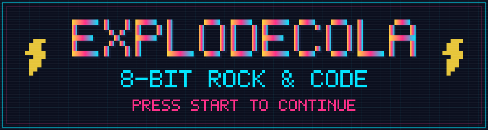
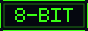
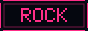
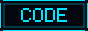
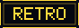
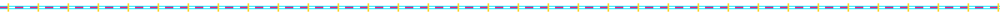
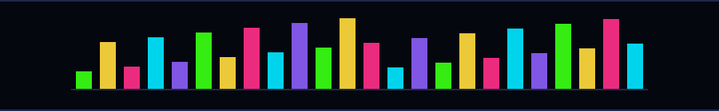

<div align="center">
  
</div>

<div align="center">
  
  
  
  
</div>

<br>

<div align="center">
  <a href="https://github.com/ExplodeCola">
    
  </a>
</div>



### `▸ PLAYER 1 — ABOUT`

<!-- ▼▼ 这一段改成你自己的：简介、城市、在做的事 ▼▼ -->
```yaml
name:      ExplodeCola
class:     Code Wizard / Bass Player
level:     99
location:  Earth
hobbies:   [coding, rock, retro games, pixel art]
status:    "compiling..."
```


### `▸ NOW PLAYING`

<div align="center">
  
</div>

<div align="center">
  
  
  
</div>


### `▸ HIGH SCORES`

<div align="center">
  
  
</div>

<div align="center">
  
</div>


### `▸ POWER-UPS`

<!-- ▼▼ 删掉你不用的，或加你自己的 ▼▼ -->
<div align="center">
  
  
  
  
  
  
  
  
</div>


### `▸ COMBO METER`

<div align="center">
  <picture>
    <source media="(prefers-color-scheme: dark)" srcset="https://raw.githubusercontent.com/ExplodeCola/ExplodeCola/output/snake-dark.svg">
    <source media="(prefers-color-scheme: light)" srcset="https://raw.githubusercontent.com/ExplodeCola/ExplodeCola/output/snake.svg">
    
  </picture>
</div>


### `▸ CONNECT`

<!-- ▼▼ 换成你自己的链接 ▼▼ -->
<div align="center">
  <a href="https://github.com/ExplodeCola"></a>
  <a href="mailto:you@example.com"></a>
  
</div>

<br>

<div align="center">
  
  <br><br>
  <sub><code>© 2026 ExplodeCola — INSERT COIN TO CONTINUE</code></sub>
</div>
